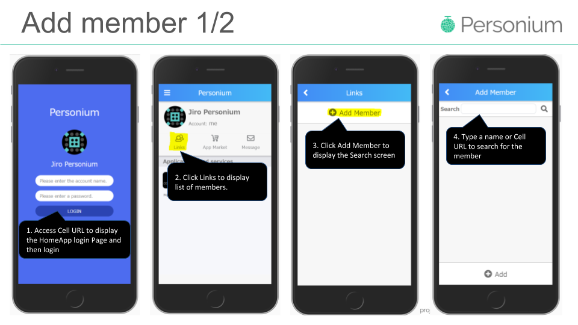
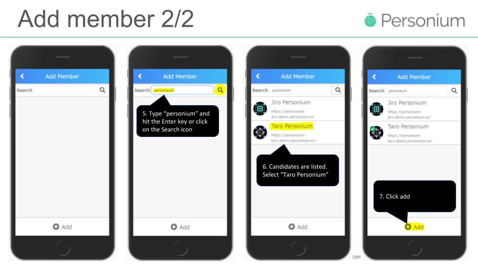
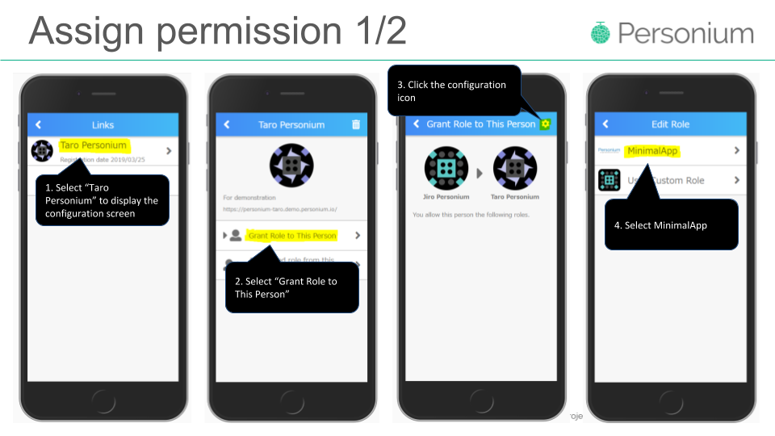
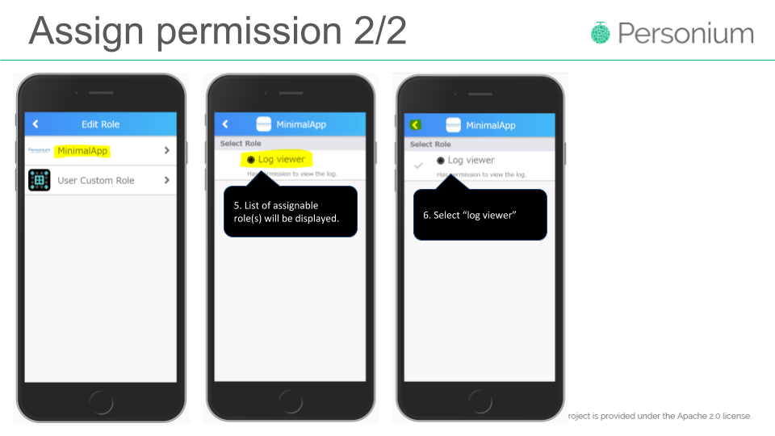
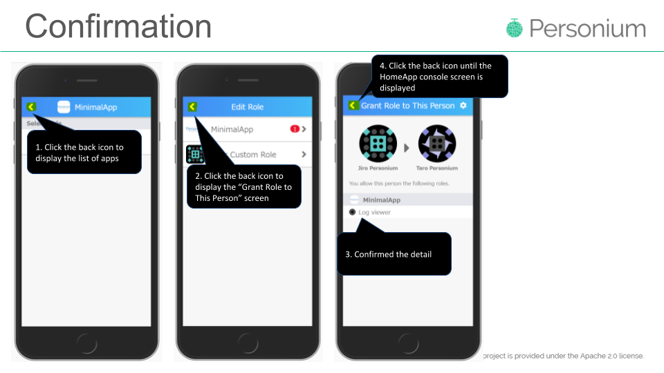

# Description  
To look inside your friend's Box, your friend needs to add you as a member in his Links and configure permission for the corresponding app.  

# Procedures  
In this example, we use the following Cell URLs. Goggle slide available [here](https://docs.google.com/presentation/d/1Cx6WRl04YfaNafFkBa-hzLcV1qHcHq1GpMRvvYvAmcg/edit?usp=sharing).  
> Your friend: https://personium-jiro.demo.personium.io  
> You: https://personium-taro.demo.personium.io  

1. Login and display the Search Screen.    
  
1. Search for "Taro Personium" and add as member.  
  
1. Select "Taro Personium" and the target app  
  
1. Assign permission  
  
1. Confirm that the permission is configured properly  
   

