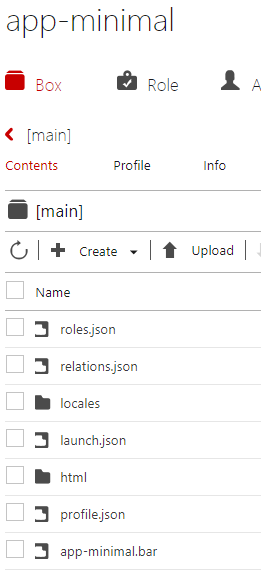
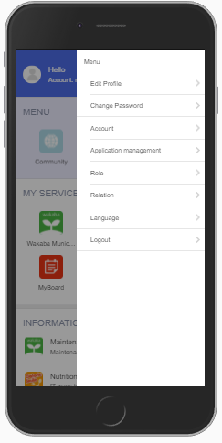
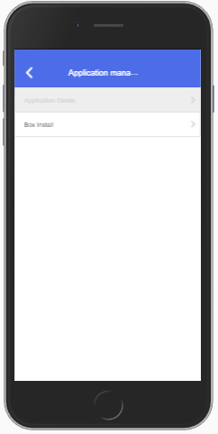
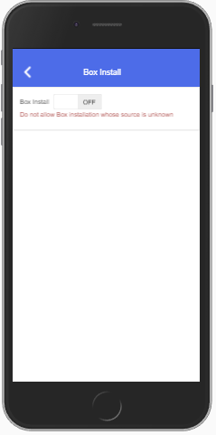
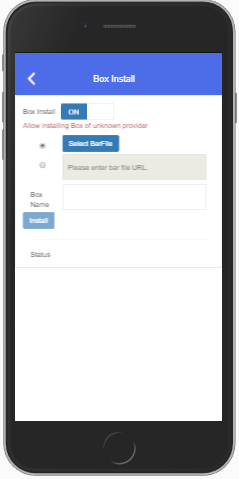
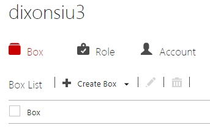

# How to deploy  
We use "https://demo.personium.io/app-minimal/" in this example, but make sure you use your own Personium Cell URL.  

1. Join our community through [Slack](https://docs.google.com/forms/d/e/1FAIpQLSeup_VHnO09yB0r-pfQuQPSZkxZrVsisiFlSuNf0MPnUFKKGw/viewform?c=0&w=1)  
1. After your slack account is activated, please write a simple message in "demo-cell-request" channel so that we will create a new cell for you.  
You also need to mention that you want an app cell, too.  
1. Once you receive your newly created app cell, please change the password of the admin account.  
1. Then, specify the cell URL for the following files:  
    1. 00_manifest.json  
    This information is used when installing your app's box.  
    [DefaultPath is not implemented yet](https://github.com/personium/personium-core/issues/51), therefore, no need to change it.
        - Before:  

                {
                  "bar_version": "1",
                  "box_version": "1",
                  "DefaultPath": "NotImplemented",
                  "schema": "https://demo.personium.io/***/"
                }

        - After (example):  

                {
                  "bar_version": "1",
                  "box_version": "1",
                  "DefaultPath": "NotImplemented",
                  "schema": "https://demo.personium.io/app-minimal/"
                }

    1. launch.json  
    This information is used by the HomeApp to lauch your app.  
        - Before:  

                {
                  "personal": {
                     "web": "https://***/***/__/src/app.html",
                     "android": "***:",
                     "ios": "***:"
                  }
                }

        - After (example):  

                {
                  "personal": {
                     "web": "https://demo.personium.io/app-minimal/__/src/app.html",
                     "android": "MinimalApp:",
                     "ios": "MinimalApp:"
                  }
                }

    1. app.js  
    Internal APIs in common.js or common_personium.js refers to the cell URL to perform all sorts of operations.  
        - Before:  

                const APP_URL = "https://***/***/";

        - After (example):  

                const APP_URL = "https://demo.personium.io/app-minimal/";

1. Create a bar file (zip format).
We recommend 7-zip for Windows environment.    
Example: app-minimal.bar  
1. Upload files (see the diagram below) to the app cell's main box using the CellManager.  
  

## How to Install the app  
You can install by either of the following ways.  

1. Access a Person Cell's HomeApp: 
    1. Access the Application Management menu  
      
    1. Tap Bar Install  
     
    1. Activate the feature  
      
    1. Fill in the information  
       
1. Access a Person Cell's Cell Manager:  
    1. Hover over the Create Box menu and click Import Box.  
      
    1. Fill in the information.  
      
