# How to deploy  
We use "https://demo.personium.io/test-dixon-app01/" in this example, but make sure you use your own Personium Cell URL.  
## Before deploying  
Download the [zip file](/app-minimal-clone.zip).  

## Deploying the files  
1. Use Cell Manager to access your app Cell.  
<a href='./step01.png' target='_blank'>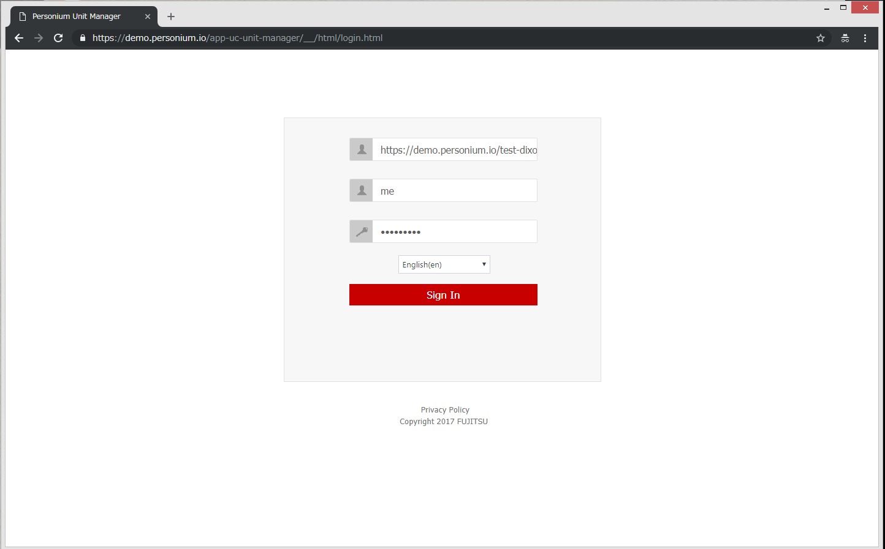</a>  
1. From Snapshot menu, click the "Upload" button and  the [zip file](/app-minimal-clone.zip).  
    - Before  
    <a href='./step02-before.png' target='_blank'>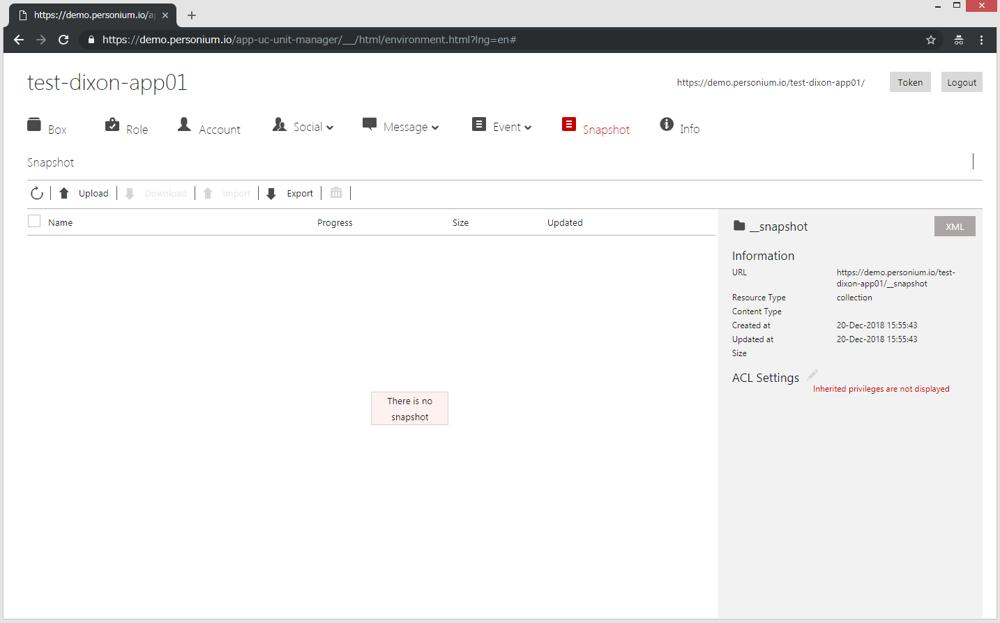</a>  
    - After  
      
1. From Snapshot menu, select the file and then click the "Import" button.   
You will be logged out automatically so that you will not be able to corrupt the Cell content.  
If your browser displays error message, ignore it and reload the page.  
    - Before:  
    <a href='./step03-before.png' target='_blank'>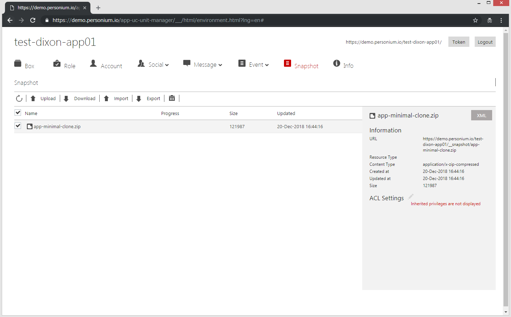</a>  
    - Confirmation:   
    <a href='./step03-confirmation.png' target='_blank'>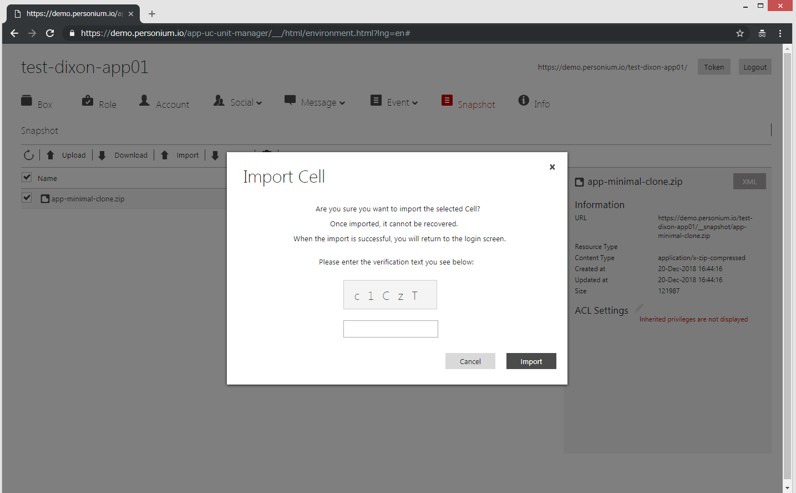</a>  
    - After:  
    <a href='./step03-after.png' target='_blank'>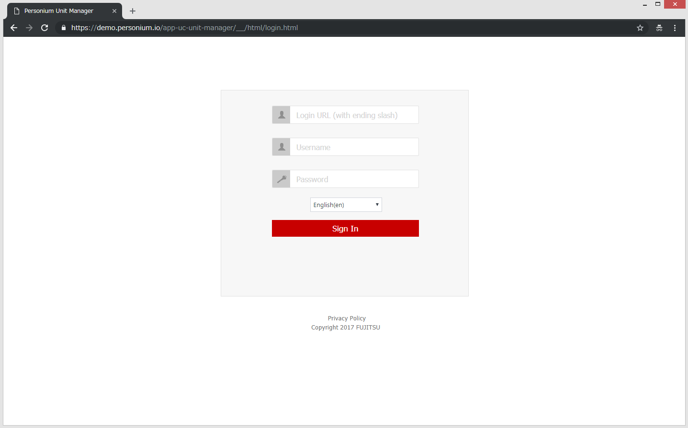</a>  
1. Wait for a minute and then Re-login.  
    - If you are using our demo environment, the following is the login information.  
    > Username: me  
    > Password: personium  
    - If you are using your Personium Unit, login as Unit Admin and set your app Cell's password again.  
1. Display the details of the Box - app by clicking it.  
    - Before  
    <a href='./step05-before.png' target='_blank'>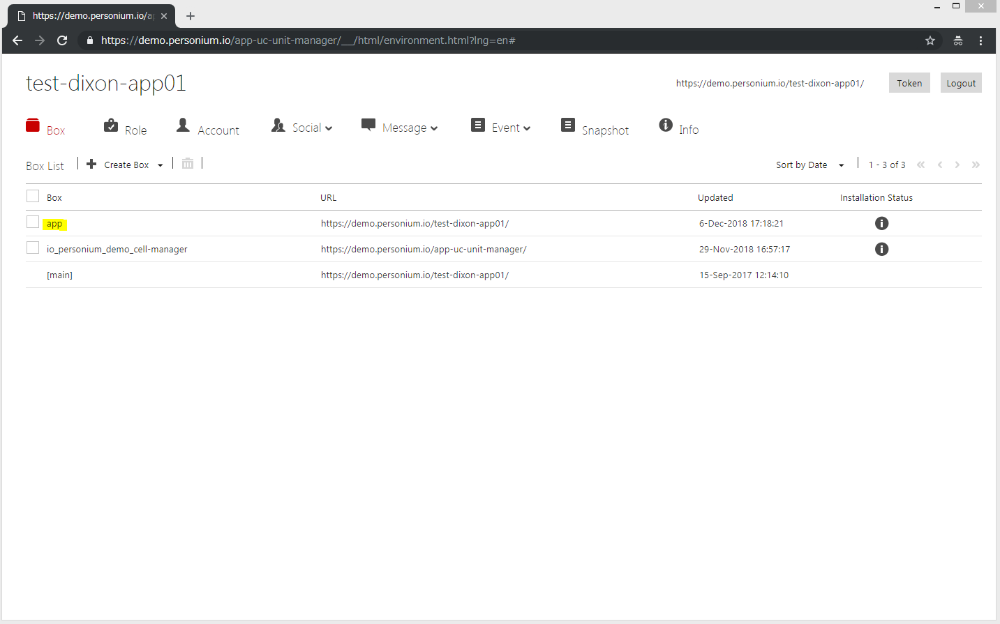</a>  
    - After  
    <a href='./step05-after.png' target='_blank'>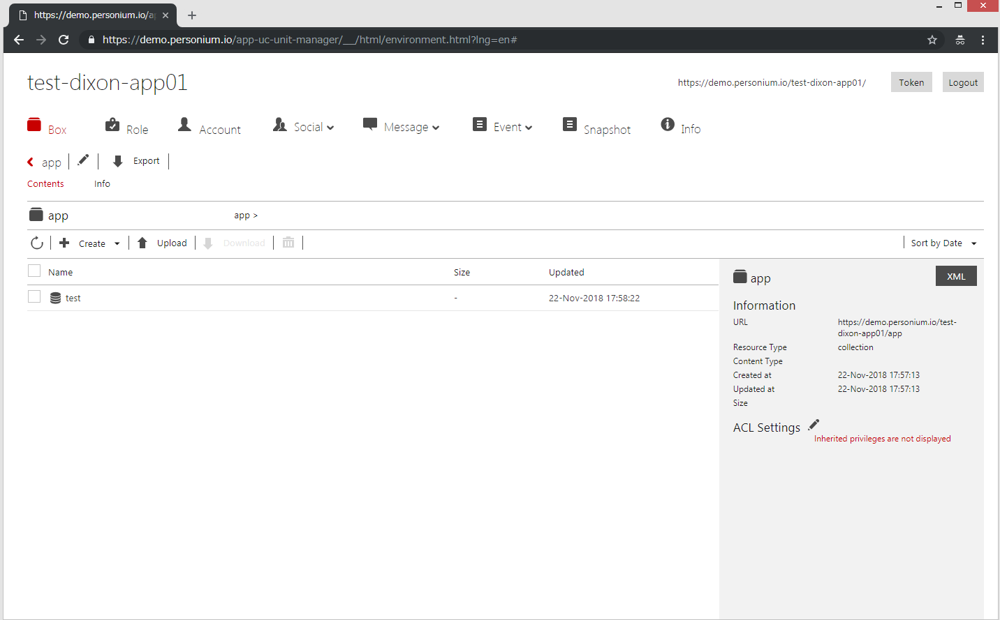</a>  
1. Modify the schema url by clicking the "Pencil" icon.  
    - Before  
    <a href='./step06-before.png' target='_blank'>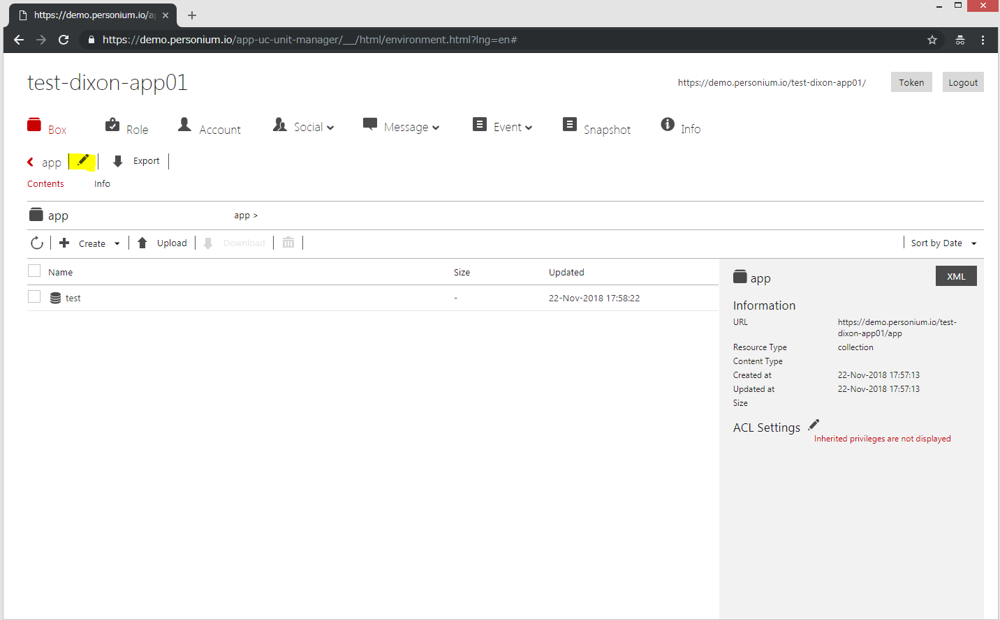</a>  
    - Enter the Schema URL.  
    It is your app Cell's URL.  
    <a href='./step06-data.png' target='_blank'>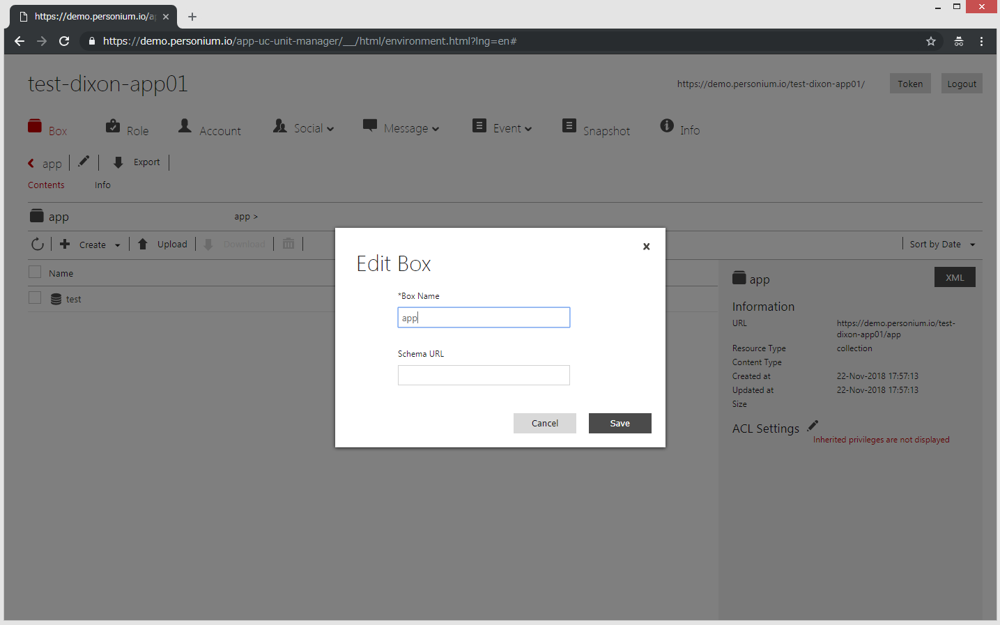</a>  
1. Export the Box (app.bar) by clicking the "Export" button.  
<a href='./step07.png' target='_blank'>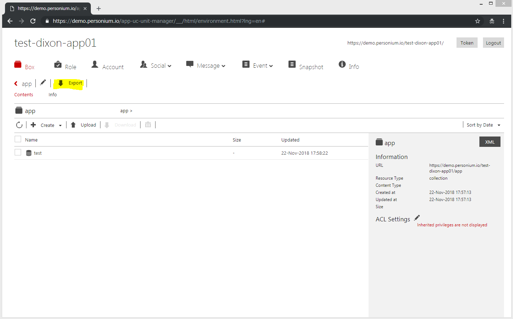</a>  
1. Display the details of the main box.  
1. Upload the app.bar to the main box by clicking the .  
    - Before  
      
    - After  
    <a href='./step09-after.png' target='_blank'>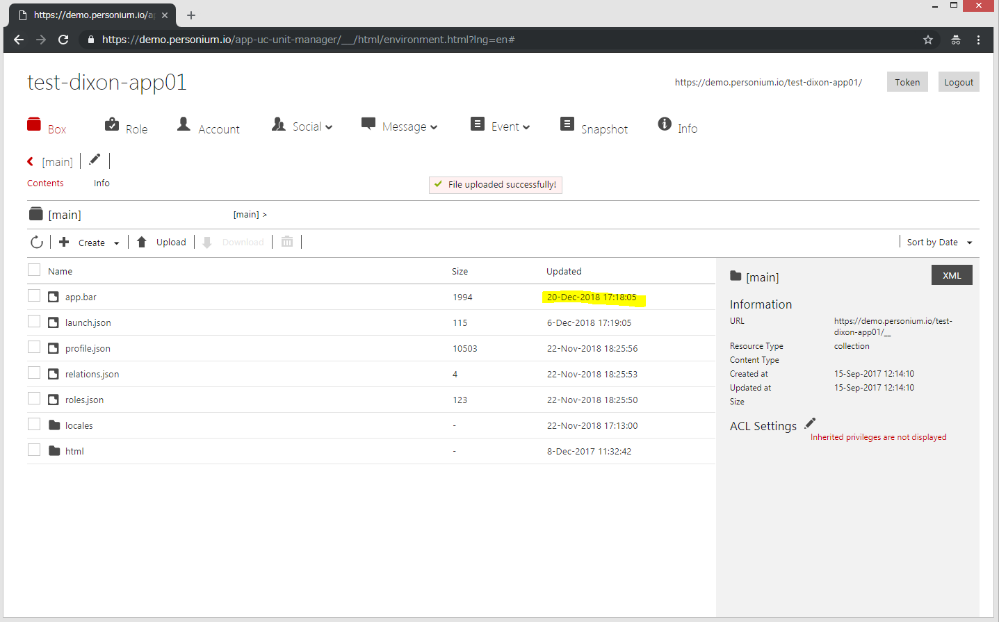</a>  
1. Specify the app Cell URL in the following files:  
    1. Download, modify then upload the launch.json  
    This information is used by the HomeApp to lauch your app.  
        - Before:  

                {
                  "personal": {
                     "web": "https://***/***/__/html/app.html",
                     "android": "***:",
                     "ios": "***:"
                  }
                }

        - After (example):  

                {
                  "personal": {
                     "web": "https://demo.personium.io/test-dixon-app01/__/html/app.html",
                     "android": "MinimalApp:",
                     "ios": "MinimalApp:"
                  }
                }

    1. Download, modify then upload the main/html/Engine/__src/acc_info.js  
    This is the file that all other Engine Script refers to when authentication is needed.  
    Double check that the Engine Service's ACL is configured to all exec (not all read) to avoid showing the ID/Password in this file. 

            /*
             * Begin of your Personium app configurations
             */
            var appCellUrl = '***'; // for example: https://demo.personium.io/appCellName/ or https://appCellName.demo.personium.io/
            var appUserId = 'tokenAcc';
            var appUserPass = '***';
            /*
             * End of your Personium app configurations
             */

    1. Perform the following to set the password (appUserPass) of 'tokenAcc' in your app Cell.  
        1. From Account menu, click tokenAcc to display details.  
            - Before  
            <a href='./step10iii-before.png' target='_blank'>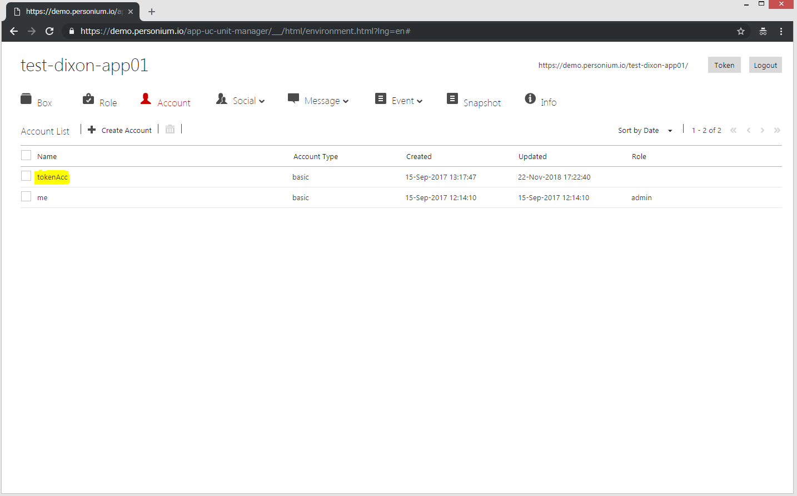</a>  
            
            - After  
            <a href='./step10iii-after.png' target='_blank'>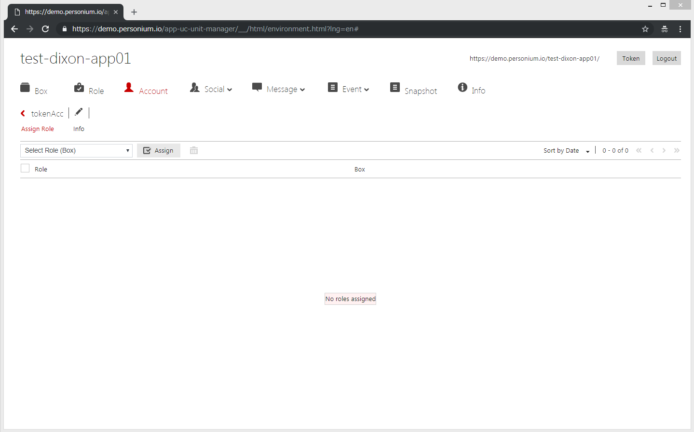</a>   

        1. Modify the password by clicking the "Pencil" icon.  
            - Before  
              
            
            - Enter the password (appUserPass) specified in acc_info.js.    
            <a href='./step10iii-edit.png' target='_blank'>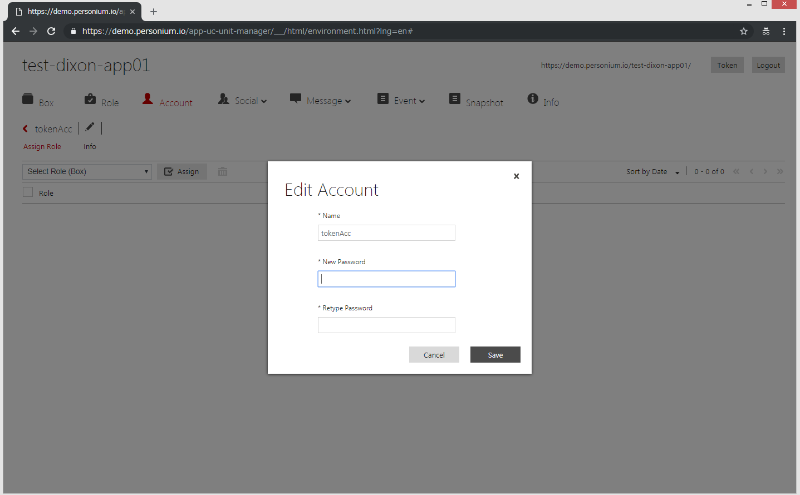</a>  
 
