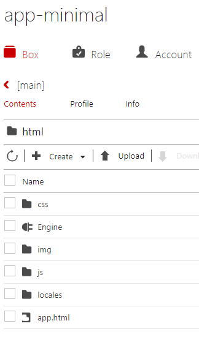

# How to deploy  
We use "https://demo.personium.io/app-minimal/" in this example, but make sure you use your own Personium Cell URL.  

## Before deploying the App  
1. Join our community through [Slack](https://docs.google.com/forms/d/e/1FAIpQLSeup_VHnO09yB0r-pfQuQPSZkxZrVsisiFlSuNf0MPnUFKKGw/viewform?c=0&w=1)  
1. After your slack account is activated, please write a simple message in "demo-cell-request" channel so that we will create a new cell for you.  
You also need to mention that you want an app cell, too.  
1. Once you receive your newly created app cell, please change the password of the admin account.  

## Deploying the files  
1. Use Cell Manager to access your Cell.  
1. Specify the cell URL for the following files:  
    1. 00_manifest.json  
    This information is used when installing your app's box.  
    [DefaultPath is not implemented yet](https://github.com/personium/personium-core/issues/51), therefore, no need to change it.
        - Before:  

                {
                  "bar_version": "1",
                  "box_version": "1",
                  "DefaultPath": "NotImplemented",
                  "schema": "https://***/***/"
                }

        - After (example):  

                {
                  "bar_version": "1",
                  "box_version": "1",
                  "DefaultPath": "NotImplemented",
                  "schema": "https://demo.personium.io/app-minimal/"
                }

    1. launch.json  
    This information is used by the HomeApp to lauch your app.  
        - Before:  

                {
                  "personal": {
                     "web": "https://***/***/__/html/app.html",
                     "android": "***:",
                     "ios": "***:"
                  }
                }

        - After (example):  

                {
                  "personal": {
                     "web": "https://demo.personium.io/app-minimal/__/html/app.html",
                     "android": "MinimalApp:",
                     "ios": "MinimalApp:"
                  }
                }

    1. app.js  
    Internal APIs in common.js or common_personium.js refers to the cell URL to perform all sorts of operations.  
        - Before:  

                const APP_URL = "https://***/***/";

        - After (example):  

                const APP_URL = "https://demo.personium.io/app-minimal/";

1. Create a bar file (zip format).
We recommend 7-zip for Windows environment.    
Example: app-minimal.bar  
1. Upload files to the app cell's main box using the CellManager.  
Unforntunately, the Cell Manager currently only support uploading one file at a time.  
    1. Upload the following files.  
        - app-minimal.bar  
        - launch.json  
        - profile.json  
        - html folder  
    1. Main Box  
      
    1. Set ACL to all-read for the following files.  
    Other pre-existed files' permission are already set.  
    Leave "html" folder alone (no ACL settings).
        - app-minimal.bar  
        - launch.json  
    1. html folder  
    Notice that Engine folder must be a Service (see details in the next section).  
      
    1. Set ACL to all-read for the following files/folders.  
    Leave "Engine" Service alone (no ACL settings).  
        - css  
        - img  
        - js  
        - locales  
        - app.html  

## Deploying the Engine Script  
1. Perform the following procedures to deploy the Engine Script.  
    1. Fill in proper information in the following section of "acc_info.js".  
    This is the file that all other Engine Script refers to when authentication is needed.  
    Replace "*** with proper information.  
    App developer should set the Engine Service to all exec (not all read) to avoid showing the ID/Password in this file. 

            /*
             * Begin of your Personium app configurations
             */
            var rootUrl = '***'; // for example: https://demo.personium.io
            var appCellName = '***'; // for example: app-minimal
            var appUserId = '***';
            var appUserPass = '***';
            /*
             * End of your Personium app configurations
             */

    1. Create a Service (unitService) under the "html" folder.  
      
    1. Upload all the files to the newly created Service's __src folder.  
        - src/html/Engine/*.js    
          
    1. Configure the access permission for the Service.  
        1. Move back up inside the main box.  
        1. Select (check mark) the Service.
        1. Click the ACL Settings edit icon (pencil) and configure the permission.  
        Assign Exec privilege to the "all (anyone)" principal.  
        1. Click the Save button.  
    1. Configure the Service.  
        1. Select (check mark) the Service.  
        1. Click Confiugre located on the upper left of the table.  
        1. Assign the Service path (getAppAuthToken) to the JavaScript file (getAppAuthToken.js).  
          
        1. Click the Register button.  
        The following is the expected result.  
          
        1. Repeat the same procedures to assign the Service path for the followings.  
            1. start_oauth2 -> start_oauth2.js
            1. receive_redirect -> receive_redirect.js
        1. Close the dialog  

    1. Verify the configuration.  
        1. Move inside the Engine's "__src" folder
        1. Confirm that the Service path (getAppAuthToken) is assigned to the file  (getAppAuthToken.js).  
        

