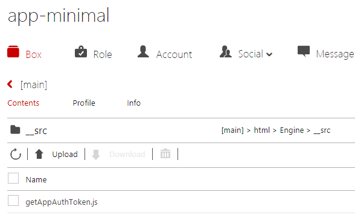
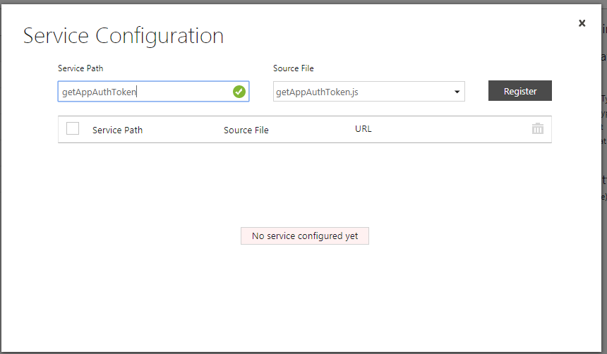
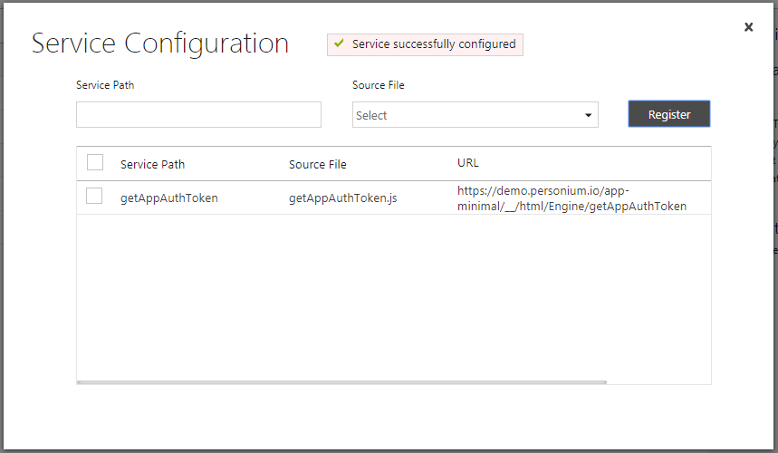
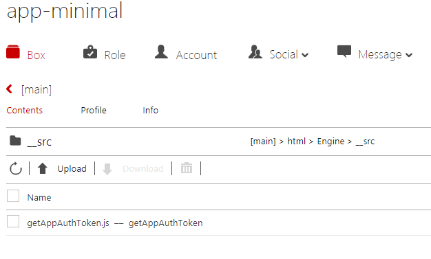

# Tips  
1. If you have access to the Personal Cell Creator.  
You can create your own app cell & app cell account.
1. You can use CellManager to create another app cell account.  
TBD  
1. QR code image  
Create an img tag on the fly using jQuery.  

        createQRCodeImg = function(url) {
            let googleAPI = 'https://chart.googleapis.com/chart?cht=qr&chs=177x177&chl=';
            let qrURL = googleAPI + url;
            let aDiv = $('
').append(
                ' ',
                $('', {
                    src: qrURL,
                    alt: url,
                    style: 'width: 200px; height: 200px'
                })
            );
            return aDiv;
        };

1. Deploying the Engine Script manually.   
Perform the following procedures to deploy the Engine Script.  
    1. Create a Service (unitService) under the "html" folder.  
          
        1. Upload all the files to the newly created Service's __src folder.  
            - src/html/Engine/*.js    
              
        1. Configure the access permission for the Service.  
            1. Move back up inside the main box.  
            1. Select (check mark) the Service.
            1. Click the ACL Settings edit icon (pencil) and configure the permission.  
            Assign Exec privilege to the "all (anyone)" principal.  
            1. Click the Save button.  
        1. Configure the Service.  
            1. Select (check mark) the Service.  
            1. Click Confiugre located on the upper left of the table.  
            1. Assign the Service path (getAppAuthToken) to the JavaScript file (getAppAuthToken.js).  
              
            1. Click the Register button.  
            The following is the expected result.  
              
            1. Repeat the same procedures to assign the Service path for the followings.  
                1. start_personium_oauth2 -> start_personium_oauth2.js
                1. receive_redirect -> receive_redirect.js
            1. Close the dialog  

        1. Verify the configuration.  
            1. Move inside the Engine's "__src" folder
            1. Confirm that the Service path (getAppAuthToken) is assigned to the file  (getAppAuthToken.js).  
            
